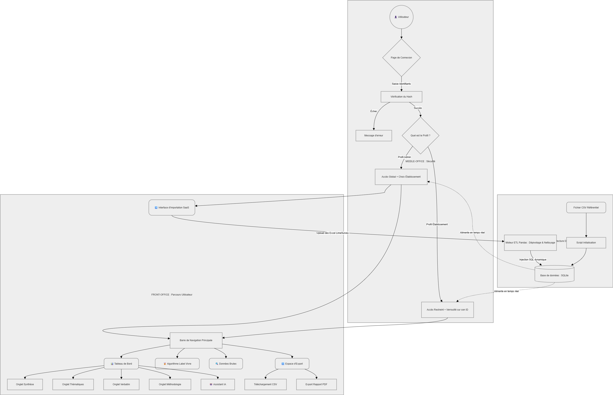

❤️ Label Vivre — Plateforme SaaS d'Analyse d'Expérience
Engagés pour nos aînés.
Une solution Business Intelligence (SaaS) innovante pour piloter la qualité perçue en EHPAD, Résidences Autonomie et Habitats Partagés.

🚀 Accès Rapide
🌐 Version Cloud : https://projetlabelvivresaas-klmvqvqzdhnjfcwh9clnv4.streamlit.app/

🔑 Comptes de Test :

Profil Admin : stephane_dardelet (Mots de passe : Sd2023!)

Profil Établissement : manon_cormier (Mots de passe : Vivre02!)

📋 Architecture du Projet
L'outil transforme les exports complexes de LimeSurvey en une interface décisionnelle simplifiée. Le pipeline de données suit un cycle ETL complet (Extract, Transform, Load).

🛠️ Stack Technique
Frontend : Streamlit (Python)

Design : CSS personnalisé + Mode Clair forcé (.streamlit/config.toml)

Base de données : SQLite (MCD Relationnel à 16 tables)

Traitement Data : Pandas & NumPy

IA & NLP : TextBlob (Analyse sémantique)

Graphiques : Plotly Express (Interactifs)

🗺️ Diagramme de Flux (Architecture)
Voici comment la donnée circule depuis l'import Excel jusqu'à l'interface utilisateur :

---
### 1. Organisation de l'archive
📂 Projet_Label_Vivre_SaaS/
│
├── 📂 .streamlit/               # Configuration du serveur
│   └── 📄 config.toml           # Force le mode clair et le design de l'app
│
├── 📂 assets/                   # Médias et ressources visuelles
│   ├── 🖼️ logo.png
│   ├── 🖼️ Diagramme_flux.drawio.jpg
│   └── 🖼️ explication visuelle du Depivotage (ETL).png
│
├── 📂 jeux_de_donnees/          # Les données brutes (Sources)
│   ├── 📊 etablissement.xlsx    # Le référentiel des établissements
│   └── 📊 (Les 9 fichiers LimeSurvey EHPAD/HAP/RA.xlsx)
│
├── 📂 scripts_sql/              # Requêtes d'analyse et architecture BDD
│   ├── 📄 analyse_moyennes_par_public.sql
│   ├── 📄 analyse_nps.sql
│   ├── 📄 analyse_requetes_croisees.sql
│   └── 📄 SCRIPT_CREATION_BDD_V1.sql
│
├── 📂 outils_admin/             # Scripts utilitaires et configuration
│   ├── 🐍 creer_hash.py
│   ├── 🐍 setup_db.py
│   ├── 🐍 verif_bdd.py
│   └── 🐍 api_limesurvey_local.py
│
├── 📂 pipeline_etl/             # Moteur de transformation de la donnée
│   ├── 🐍 etl_limesurvey.py
│   ├── 🐍 import_structure.py
│   └── 🐍 patch_donnees.py
│
├── 🐍 app.py                    # ⭐ Le cœur : L'application web principale
├── 🗄️ label_vivre.sqlite        # ⭐ La base de données en production
├── 📄 requirements.txt          # ⭐ Les dépendances Python (pour l'installation)
├── 📖 README.md                 # ⭐ La documentation métier et technique
└── 📄 .gitignore                # ⭐ Les règles d'exclusion pour GitHub
## 🗺️ Architecture & Flux de données
Le projet repose sur une séparation stricte entre les données brutes et le moteur d'analyse.

### 2. Diagramme de Flux (Utilisateur & Système)
Le schéma complet détaillant le parcours de la donnée (de l'import à la visualisation) est disponible dans le dossier des ressources.

### 3. Pipeline ETL : La "Moulinette" de Transformation
Pour transformer les exports LimeSurvey (format "Large") en une base de données relationnelle (format "Long"), nous utilisons un script de transformation (ETL) basé sur Python et Pandas.

**Le concept du Dépivotage (Melt) :**
* **Format Source (LimeSurvey) :** Chaque question est une colonne. Inexploitable pour des calculs transversaux.
* **Format Cible (SQLite) :** Chaque réponse devient une ligne unique liée à un `ID_Repondant` et un `Id_questionnaire`.

| Étape | Action | Résultat |
| :--- | :--- | :--- |
| **Extract** | Lecture des 9 fichiers Excel | Chargement des DataFrames |
| **Transform** | Opération `pd.melt()` | Conversion colonnes ➔ lignes |
| **Load** | `df.to_sql()` | Injection dans la table `REPONSE` |

---

✨ Fonctionnalités Majeures

📊 Dashboard Dynamique : Visualisation épurée des KPIs stratégiques (NPS avec calcul strict Label Vivre, Satisfaction Moyenne, Vigilance Bientraitance). Analyse thématique via un Radar comparant l'établissement à la moyenne globale.

🏅 Moteur de Labellisation : Algorithme vérifiant en temps réel l'éligibilité au label selon les seuils réglementaires du Critère 1 (Taux de réponses négatives) et du Critère 2 (Score sur 10 par public).

💬 Analyse IA des Verbatims : Extraction automatique des points forts et des pistes d'amélioration via le traitement du langage naturel (TextBlob), avec segmentation automatique par type de public (Résident, Proche, Équipe).

🤖 Assistant "Chat with Data" : Un démonstrateur d'IA conversationnelle permettant d'interroger la base de données en langage naturel (Démonstration de la vision SaaS 2026).

📋 Méthodologie Dynamique : Fini les données figées. Le système calcule automatiquement le nombre réel de répondants uniques et les taux de réponse par public directement depuis la base LimeSurvey.

📁 Structure des fichiers
app.py : Application principale et gestion des droits d'accès.

etl_limesurvey.py : Nettoyage et pivotage des données (Attribution automatique des Id_questionnaire).

import_structure.py : Importation du référentiel des 31 établissements.

patch_donnees.py : Enrichissement de la base (Dates, Géolocalisation, IDs).

label_vivre.sqlite : Base de données relationnelle complète.

.streamlit/config.toml : Configuration du thème visuel.

💻 Installation Locale (Développeurs)
Bash
# 1. Récupération du dépôt
https://github.com/David-ABS/Projet_Label_Vivre_SaaS.git

# 2. Installation des dépendances
pip install -r requirements.txt

# 3. Lancement de l'interface
python -m streamlit run app.py

👥 Équipe Projet
Lead Tech & Data : David

Data Analysis : Fatima

UX/UI Design : Nancy
